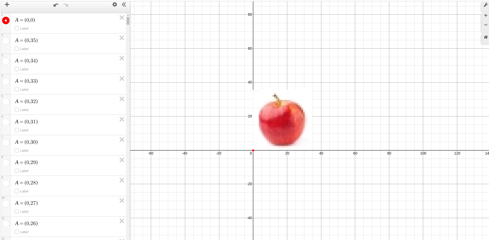
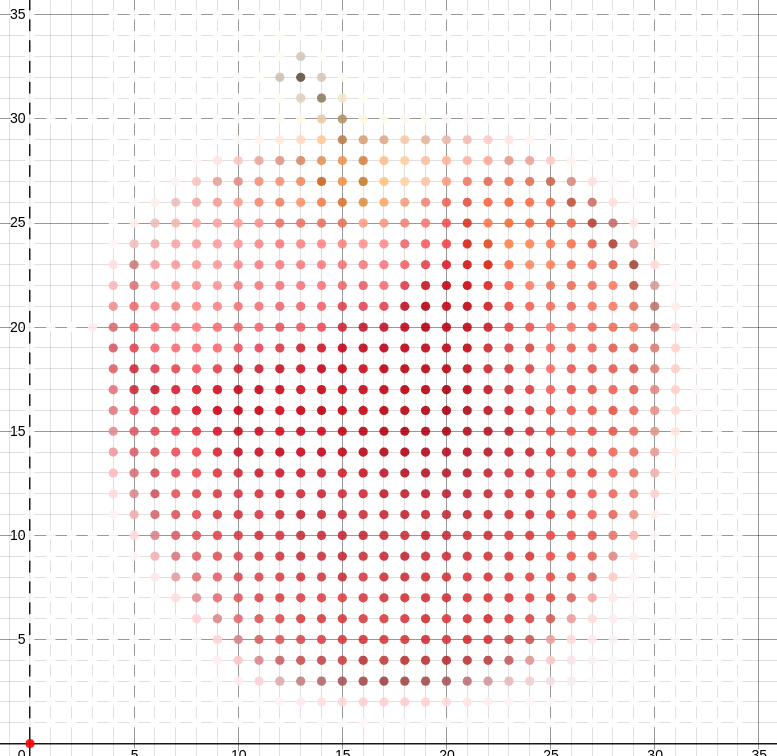
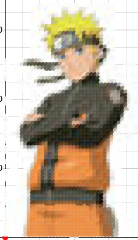

I was messing around with various APIs and I stumbled across a feature in Desmos that allows you to place a colored pixel anywhere on the graph. I instantly wanted to set up a script that would draw out an image.

I decided to start small and make an apple. Here is the original image (low res for performance):

Now I made each pixel of that apple a point on desmos:

As you can see, if we zoom into each of those pixels, we can see each individual one:

The natural next step was to draw Naruto, and so I did:

