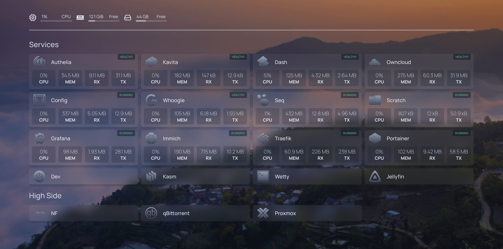

# Here's my dashboard

It's been a wild ride setting up and securing this lab. This is running on an old gaming computer I own at home. I've been loving using it for a long time now, but I've found myself wanting more. More of a challenge, more reliability, more everything.

This is a little more :)

It's a [SuperServer 6018U-TR4+](https://www.supermicro.com/en/products/system/1u/6018/sys-6018u-tr4_.cfm). I have it spec'd out with 48 cores, 128gb of ram, 750W redundant power supplies, and more storage than I'll ever need. 

But the extra cool part is that I'm colocating this server in a server farm near me!

This is quite expensive, so I'm splitting costs with a friend.

I'm going to be using this server to host all my docker containers, but also my autonomous system! I'm the proud operator of [AS214681](https://as214681.net/). 

It's a really cool feeling to VPN into the VPS that runs my AS and then go to a "what is my ip" site only to see my name come up. I've been thinking it would be even cooler to do that through a powerful colocated server that could handle my daily traffic.

Next post on this coming soon!

