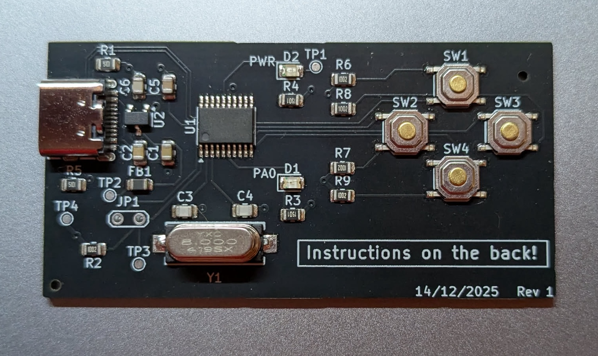
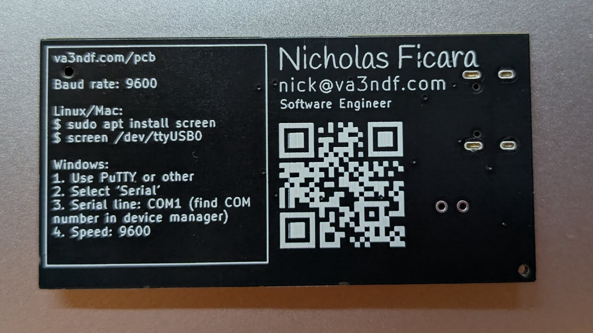
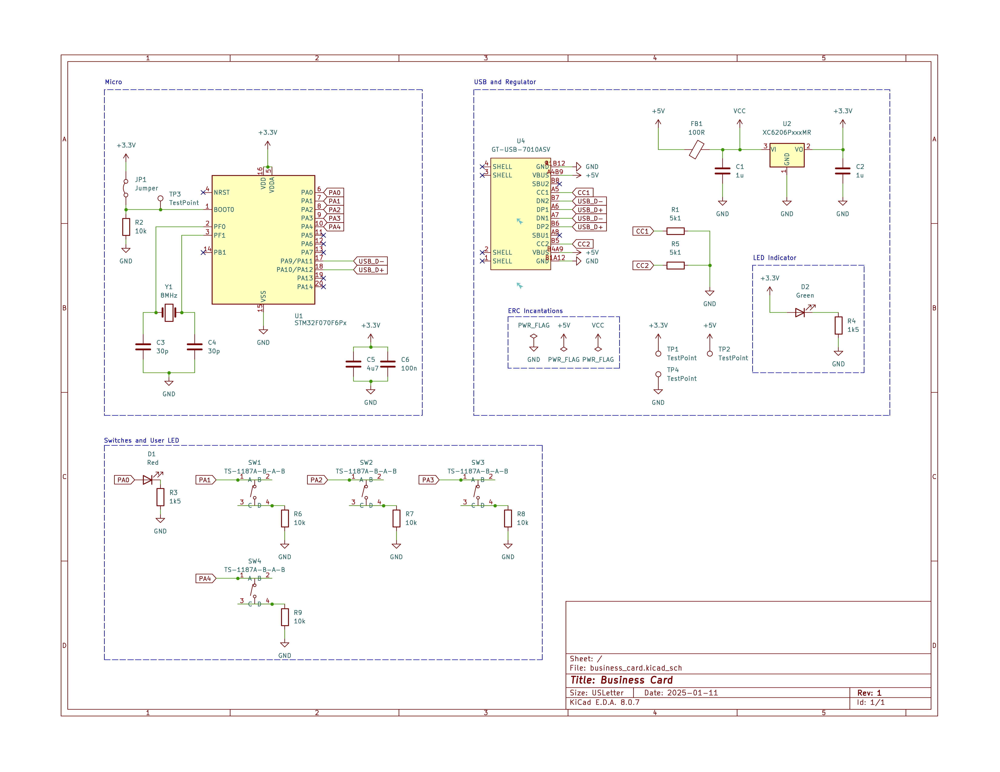

# Front

# Back

# Schematic
4 buttons, 2 lights, 1 STM32F0, 1 USB-C Receptacle. All you really need :)

# So what does it do?

I had a few requirements for this thing:
1. Look really cool (achieved by the matte black)
2. Have my name on it and a link to my site
3. Contain puzzles!

So you plug it in, open a serial port, and then boom! You're greeted with a bash style prompt. There are a few POSIX style utilities included within it, but they are only emulated as most operating systems don't fit on this STM32F0 chip.

Once you're on this emulated shell, there are a few puzzles you can play through and (of course) my resume is somewhere in there. Always on the hunt for a cool embedded job :)

A note on programming it: I don't want to be distributing physical hardware that becomes useless after playing with it for a few minutes. That's why it's fully reprogrammable! Some STM chips come with a burned in bootloader that allows DFU programming over direct USB-C (i.e. the D+ D- differential pair going straight into the chip). The chip I chose happens to be one of them! All you need to do is jump JP1 with a paperclip and it goes into programming mode. (i.e. it boots off the burned in bootloader for programming)

Can't wait to give this out at hackathons!
